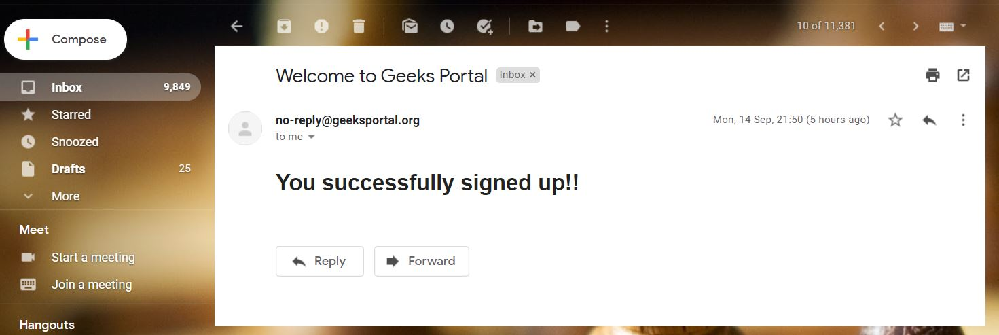

# GeeksPortal
# ⛔️ DEPRECATED
***This website is deprecated and is no longer actively maintained.***

# Technology Used 


Website Link : http://secure-woodland-97885.herokuapp.com/

This is a website where users can publish there article which are being reviewed by the reviewers 
There is a portal for users and reviewers 

Reviewers are being appointed by the admins 


NOTE: This website is not responsive :(
```
/reviewers/auth/login
```
There is a portal for admin as well 
 ```
 /panelforadmin/auth/login
 ```
 the admin is created directly in database and then admin can create reviewers check the action of users ,can ban user from coming and many more functionalities
 
 
```
```
 
```
```
 
 ```
 ```
 
```
```
 
 ```
 ```
 

 ```
 ```
 
 ```
 ```
 
 ```
 ```
 
 ```
 ```
 
 ```
 ```
 
 ```
 ```
 
 ```
 ```
 


## License
GeeksPortal is released under the [MIT License](http://www.opensource.org/licenses/MIT).
